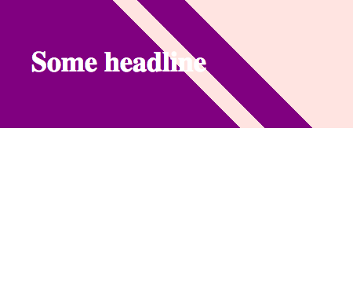

# Gradient Hero

Lass uns den folgenden Effekt mit CSS-Farbverläufen nachstellen.
- Verwende das Bild aus dem Ordner `images` als Hintergrund für deine Seite.
- Achte darauf, dass das Bild nicht nur die gesamte Seite abdeckt, sondern auch zentriert ist.

## Farbverläufe und Bild

- [Weitere Referenz](https://css-tricks.com/css3-gradients/)

## Bonus (Extra)

### Ball mit 3D-Effekt

### Farbverlauf mit Stopps

